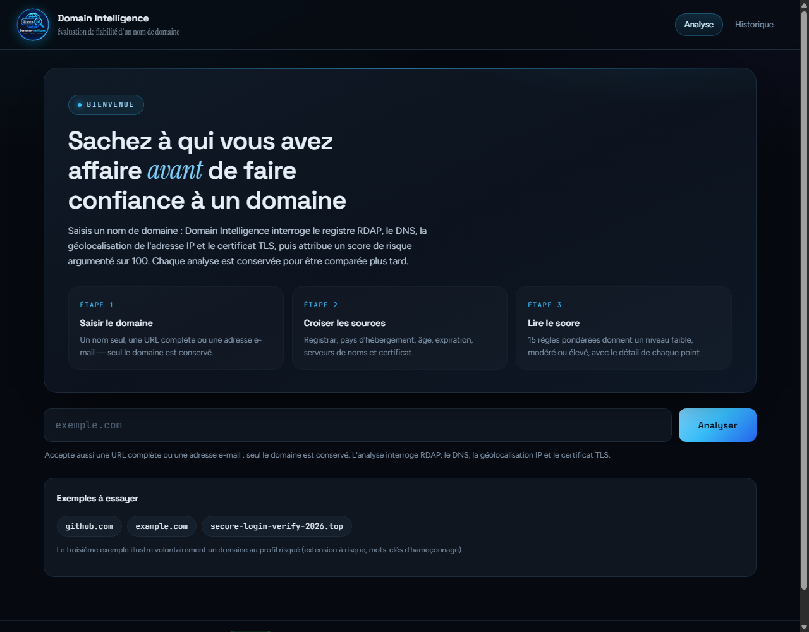
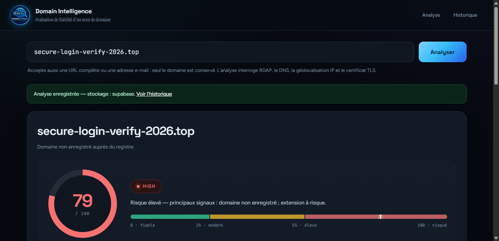
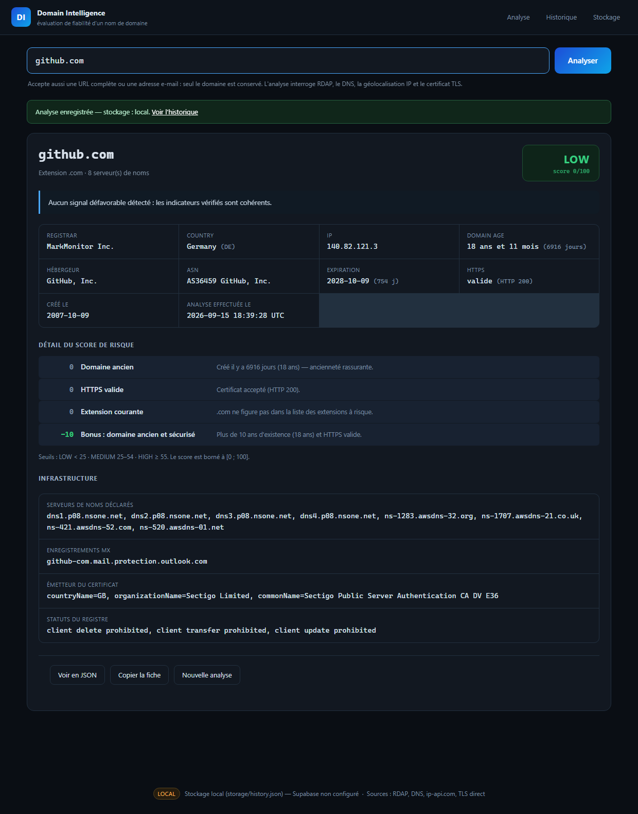
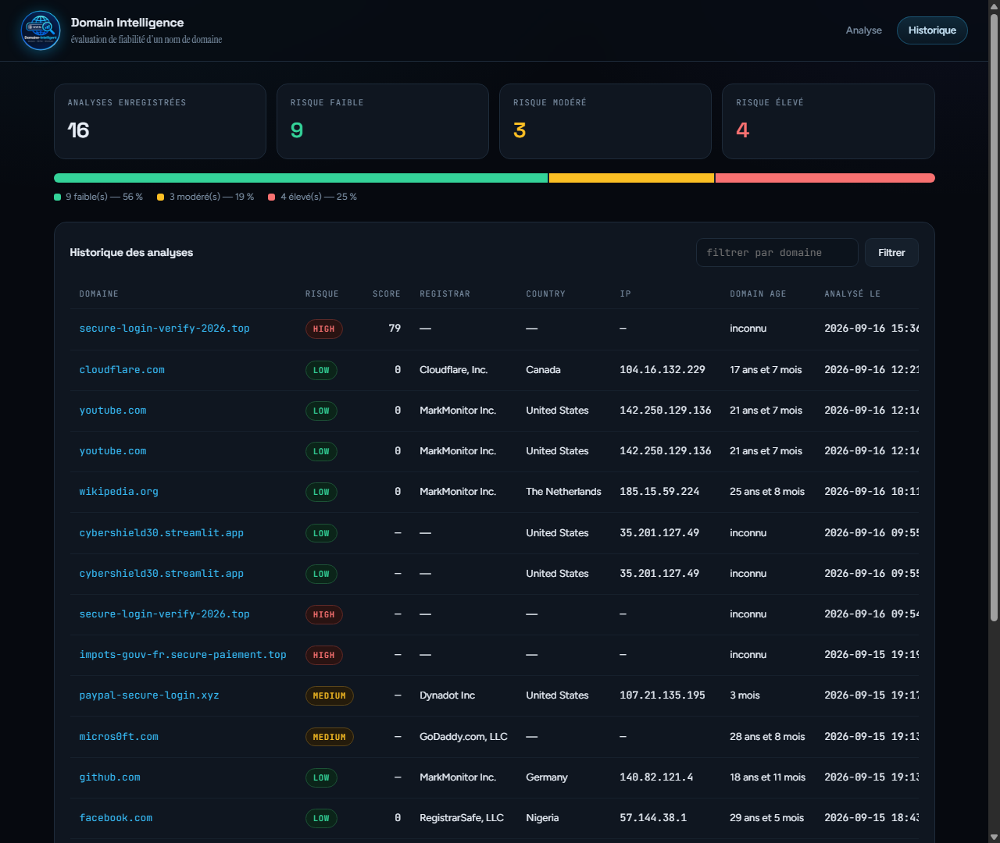
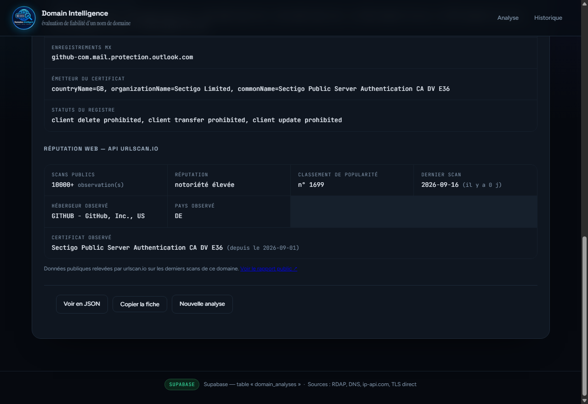
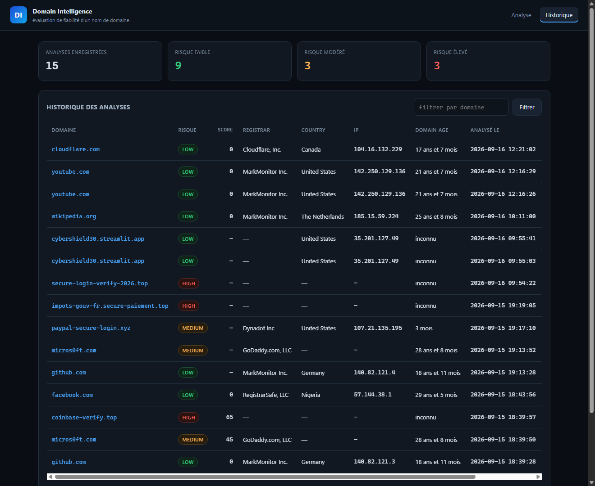
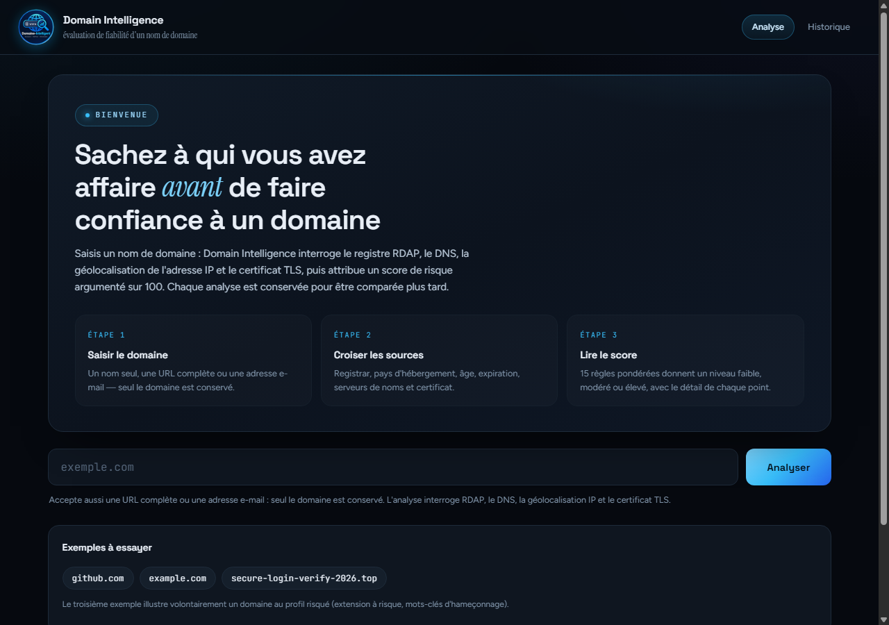

# Domain Intelligence

**Analyse de fiabilité d'un nom de domaine** — application **Python / Flask**.

> Saisir un domaine → interroger des API externes → obtenir une fiche complète,
> un score de risque argumenté sur 100, et un historique consultable.

**Démonstration en ligne : <https://domain-intelligence.up.railway.app/>**



---

## 1. Nom du projet

**Domain Intelligence** — outil d'aide à la décision pour évaluer la fiabilité
d'un nom de domaine avant de lui accorder sa confiance.

| | |
|---|---|
| **Dépôt** | <https://github.com/laviOGOU/domain-intelligence> |
| **Auteur** | laviOGOU |
| **Nature** | Projet pédagogique, en Python |
| **Licence d'usage** | Projet personnel — voir la section « Avertissement » |

---

## 2. Problème résolu

Un analyste reçoit un nom de domaine et doit décider **rapidement** s'il peut s'y
fier : lien reçu par courriel, domaine repéré dans un journal, site à visiter
avant de saisir un mot de passe.

Aujourd'hui cette vérification se fait à la main, dans plusieurs outils séparés :
un site de WHOIS pour le registrar, un autre pour la géolocalisation de l'IP, un
terminal pour le certificat HTTPS. C'est long, partiel, et rien n'est conservé :
au domaine suivant, tout est à refaire.

**Domain Intelligence rassemble ces vérifications en une seule saisie et rend un
verdict explicable.**

Ce que l'outil apporte concrètement :

- **Une seule saisie** au lieu de quatre outils — l'analyse complète prend 2 à 4 secondes.
- **Un score argumenté, jamais une note opaque** : chaque point du score est affiché
  avec son libellé et son explication, l'analyste voit *pourquoi* le domaine est jugé risqué.
- **Une mémoire** : toutes les analyses sont conservées, comparables et consultables,
  avec recherche par domaine.
- **Une intégration possible** dans un script, via une API JSON.

---

## 3. Fonctionnalités

### Les 7 fonctions demandées par l'énoncé

| # | Fonction | Où c'est implémenté |
|---|---|---|
| 1 | Saisie d'un nom de domaine | `web/templates/index.html` (formulaire) + `analyzer.normalize_domain()` |
| 2 | Interrogation d'API externes | `providers/rdap.py`, `providers/network.py` |
| 3 | Récupération des informations | `analyzer.analyze()` (appels parallèles) |
| 4 | Affichage sous forme de fiche | `web/templates/index.html` |
| 5 | Attribution d'un niveau de risque | `risk.py` (score sur 100 → LOW / MEDIUM / HIGH) |
| 6 | Enregistrement dans Supabase | `db.py` (`save_analysis`) |
| 7 | Affichage de l'historique | `web/templates/history.html` + `db.list_analyses()` |

### Écran d'accueil

Message de bienvenue, rappel des trois étapes de l'analyse et exemples cliquables
pour démarrer en un clic.

### Diagramme de risque

Sur chaque fiche, un diagramme rend le niveau lisible d'un seul regard :

- **jauge circulaire** dont l'arc se remplit proportionnellement au score (0 → 100) ;
- **pastille de niveau** colorée — vert (faible), ambre (modéré), rouge (élevé) ;
- **synthèse en clair** du verdict ;
- **échelle graduée** de 0 à 100 découpée aux seuils réels de l'application, avec un
  repère planté sur le score obtenu.

Le diagramme est en CSS pur (dégradé conique piloté par une variable) : aucune
bibliothèque de graphiques, aucune requête externe. Les seuils affichés viennent de
la configuration — les modifier dans `.env` met le diagramme à jour automatiquement.

### Détail du score

Sous le diagramme, chaque règle déclenchée est listée avec les points qu'elle a
apportés, son libellé et son explication. Le score n'est jamais une boîte noire.

### Réputation web — API urlscan.io

Une rubrique dédiée de la fiche restitue ce que l'API externe urlscan.io a observé
sur le domaine :

- nombre de scans publics déjà réalisés ;
- classement de popularité (Cisco Umbrella) et libellé de notoriété ;
- hébergeur, pays et système autonome réellement observés ;
- certificat présenté au moment du scan, avec sa date de validité ;
- lien vers le rapport public complet.

Deux de ces éléments alimentent directement le score (voir le tableau des règles).

### Historique

Compteurs par niveau, **diagramme de répartition** de l'ensemble des analyses,
recherche par domaine, réaffichage d'une fiche passée et suppression.

### API JSON

| Méthode | Route | Description |
|---|---|---|
| GET | `/api/analyze?domain=example.com` | Analyse un domaine et l'enregistre |
| GET | `/api/analyze?domain=example.com&save=0` | Analyse sans enregistrer |
| GET | `/api/history?limit=20&q=github` | Historique, avec recherche |
| GET | `/api/analysis/<id>` | Fiche complète d'une analyse |
| DELETE | `/api/analysis/<id>` | Supprime une analyse |
| GET | `/api/status` | Backend actif et compteurs |

```bash
curl "http://127.0.0.1:5001/api/analyze?domain=example.com"
```

### Garantie d'enregistrement — aucune analyse perdue

Si l'écriture en base échoue pour une raison **passagère** (réseau coupé, DNS, délai
dépassé), le traitement continue tout seul : l'écriture est retentée, puis l'analyse
est mise en file d'attente locale et renvoyée automatiquement dès que la connexion
revient. Un contrôle d'idempotence évite les doublons. Une erreur **définitive** (clé
refusée, table absente) est en revanche affichée telle quelle — c'est la configuration
qu'il faut corriger, pas la connexion.

### Calcul du risque

Score sur 100, borné à `[0 ; 100]` :

| Points | Signal |
|---|---|
| +40 | Domaine créé il y a moins de 30 jours |
| +40 | Domaine non enregistré au registre |
| +30 | Créé il y a moins de 90 jours |
| +25 | HTTPS absent ou certificat invalide |
| +20 | Le domaine ne résout pas (aucune IP) |
| +20 | Domaine expiré |
| +18 | Créé il y a moins d'un an |
| +15 | Site web injoignable en HTTPS |
| +15 | Extension à risque (.tk, .ml, .top, .click, .xyz, .zip…) |
| +12 | Jeune domaine jamais observé par l'API urlscan.io |
| +12 | Expire dans moins de 60 jours |
| +10 | Termes sensibles dans le nom (login, verify, secure, account…) |
| +10 | Redirection vers un autre domaine |
| +10 | IP signalée comme proxy / VPN |
| +8 | Registrar non publié |
| +8 | Domaine établi (1 à 3 ans d'existence) |
| +8 | Nom contenant 4 chiffres ou plus |
| +6 | Nom contenant 3 tirets ou plus |
| +5 | Date de création non publiée |
| −8 | Domaine parmi les plus visités du web (API urlscan.io, classement ≤ 100 000) |
| −10 | Plus de 10 ans d'existence **et** HTTPS valide |

Niveaux : **LOW** < 25 · **MEDIUM** 25–54 · **HIGH** ≥ 55 (seuils réglables dans `.env`).

Deux garde-fous importants :

- **Une panne de notre côté n'est pas un risque.** Si le registre RDAP est
  injoignable (quota dépassé, réseau), le score ne pénalise pas le domaine : la
  limite est signalée à 0 point. Sans cette règle, le même domaine pouvait passer
  de « MEDIUM 45 » à « HIGH 63 » selon la disponibilité du réseau.
- **Pas de double comptage.** Pour un domaine non enregistré, les tests DNS et HTTPS
  échouent forcément : ils ne sont pas comptés une seconde fois.

### Exemple de fiche produite

```
Domain : micros0ft.com
Registrar : GoDaddy.com, LLC
Country : — (hébergement non résolu)
IP : —
Domain age : 28 ans et 8 mois (10486 jours)
Risk : MEDIUM (score 45/100)
Analyse effectuée le : 2026-09-15 18:39:50
```

---

## 4. Technologies utilisées

| Domaine | Technologie | Rôle dans le projet |
|---|---|---|
| Langage | **Python 3.11** | Tout le projet est en Python |
| Framework web | **Flask 3** | Routes, gabarits, API JSON |
| Gabarits | **Jinja2** | Rendu HTML côté serveur |
| HTTP | **requests** | Appels aux API externes |
| DNS | **dnspython** | Résolution A / NS / MX / TXT |
| Base de données | **Supabase** (PostgreSQL) | Persistance des analyses |
| Client base | **supabase-py** | Insertion et lecture via l'API REST |
| Configuration | **python-dotenv** | Lecture du fichier `.env` |
| Parallélisme | **concurrent.futures** | Appels externes simultanés |
| Interface | **HTML / CSS / JavaScript natifs** | Aucun framework front, aucune dépendance CDN |
| Typographie | **Space Grotesk, Figtree, Instrument Serif** | Google Fonts, avec repli sur les polices système |
| Hébergement | **Railway** | Déploiement public |

---

## 5. API utilisée

### Les API externes réellement appelées par l'application

Chaque analyse déclenche **cinq appels réseau simultanés**, et chaque réponse est
exploitée : elle remplit la fiche, alimente le score de risque, ou les deux.

| # | API externe | Endpoint réellement appelé | Code | Ce que la réponse apporte |
|---|---|---|---|---|
| 1 | **RDAP** — rdap.org | `GET https://rdap.org/domain/<domaine>` | `providers/rdap.py` | Registrar, dates de création / expiration / modification, statuts du registre, serveurs de noms → affichage + **3 règles de score** |
| 2 | **ip-api.com** | `GET http://ip-api.com/json/<ip>` | `providers/network.py` | Pays, ville, fournisseur, organisation, ASN, indicateurs proxy / VPN → affichage + **2 règles de score** |
| 3 | **urlscan.io** | `GET https://urlscan.io/api/v1/search/?q=page.domain:<domaine>&size=1` | `providers/urlscan.py` | Nombre de scans publics, classement de popularité Cisco Umbrella, hébergeur et pays réellement observés, certificat présenté → affichage + **2 règles de score** |
| 4 | **DNS** | résolution A / NS / MX / TXT | `providers/network.py` | Adresses IPv4, serveurs de noms, enregistrements de messagerie → affichage + **1 règle de score** |
| 5 | **TLS** | poignée de main `ssl` sur le port 443 | `providers/network.py` | Validité, émetteur et date d'expiration du certificat → affichage + **1 règle de score** |

Et en écriture : **Supabase REST** (`POST /rest/v1/domain_analyses`), appelée par
`db.py` après chaque analyse.

> **Aucune clé ni inscription n'est nécessaire** pour ces API : elles sont ouvertes.
> C'est une facilité d'usage, pas une absence d'API.

### Preuve d'appel réel

Voici l'appel que l'application fait réellement à l'API urlscan.io :

```bash
curl "https://urlscan.io/api/v1/search/?q=page.domain:github.com&size=1"
```

```json
{
  "total": 10000,
  "has_more": true,
  "results": [
    {
      "page": {
        "url": "https://github.com/",
        "server": "github.com",
        "ip": "140.82.121.3",
        "asn": "AS36459",
        "asnname": "GITHUB - GitHub, Inc., US",
        "country": "DE",
        "umbrellaRank": 1699,
        "tlsIssuer": "Sectigo Public Server Authentication CA DV E36"
      },
      "task": { "time": "2026-09-16T16:46:27.379Z", "uuid": "01a0ab1c-b3e9-70f7-8012-84554a0446e5" }
    }
  ]
}
```

Ces valeurs se retrouvent telles quelles dans la fiche, à la rubrique
**« Réputation web — API urlscan.io »** (capture en section 9) :
10000 observations, notoriété élevée, classement n° 1699, hébergeur
« GITHUB - GitHub, Inc., US », pays observé DE.

Appel à l'API RDAP, sur le même principe :

```bash
curl "https://rdap.org/domain/github.com"
```

**Politique de panne** : les appels sont lancés en parallèle dans un
`ThreadPoolExecutor`. Si une API est injoignable ou refuse la requête (quota
dépassé), la limite est écrite dans la rubrique « Limites de cette analyse » de la
fiche et **le score n'est pas pénalisé** : c'est notre panne, pas un risque du
domaine analysé.

---

## 6. Installation

### Prérequis

- **Python 3.11 ou plus récent** — <https://www.python.org/downloads/>
- Un compte **Supabase** gratuit (facultatif : sans lui, l'application fonctionne
  avec un stockage local dans `storage/history.json`)
- Aucune clé d'API tierce n'est requise

### Étapes

```bash
# 1. Récupérer le projet
git clone https://github.com/laviOGOU/domain-intelligence.git
cd domain-intelligence

# 2. Créer l'environnement virtuel
python -m venv .venv

# 3. L'activer
.venv\Scripts\activate          # Windows
source .venv/bin/activate       # macOS / Linux

# 4. Installer les dépendances
pip install -r requirements.txt

# 5. Créer le fichier de configuration
copy .env.example .env          # Windows
cp .env.example .env            # macOS / Linux
#    puis renseigner les valeurs (voir section 7)

# 6. Lancer l'application
python app.py
```

L'application est ensuite disponible sur **<http://127.0.0.1:5001>**.

Sur Windows, un raccourci est fourni : double-clique sur **`lancer_app.bat`**.

> La fenêtre du terminal doit rester ouverte : la fermer arrête le serveur.
> En local, le serveur écoute uniquement sur `127.0.0.1` — il n'est pas accessible
> depuis le réseau. En hébergement, il écoute sur `0.0.0.0` et sur le port imposé
> par la plateforme.

---

## 7. Variables d'environnement

Toutes les valeurs se placent dans un fichier **`.env`** à la racine du projet,
à côté de `app.py`. Ce fichier **n'est jamais versionné** (il est listé dans
`.gitignore`) ; le modèle `.env.example` sert de référence.

| Variable | Obligatoire | Rôle | Exemple |
|---|---|---|---|
| `SUPABASE_URL` | non | Adresse du projet Supabase | `https://abcdefgh.supabase.co` |
| `SUPABASE_KEY` | non | Clé **anon** — clé publique prévue pour un client | `eyJhbGciOi...` |
| `SUPABASE_TABLE` | non | Nom de la table (défaut : `domain_analyses`) | `domain_analyses` |
| `SUPABASE_SERVICE_KEY` | non | Clé **service**, dépannage uniquement (contourne la RLS) | `eyJhbGciOi...` |
| `SUPABASE_ACCESS_TOKEN` | non | Jeton personnel, pour `init_supabase.py` | `sbp_...` |
| `SUPABASE_RETRIES` | non | Nombre de tentatives d'écriture avant mise en file | `3` |
| `APP_HOST` | non | Adresse d'écoute locale (défaut : `127.0.0.1`) | `127.0.0.1` |
| `APP_PORT` | non | Port d'écoute local (défaut : `5001`) | `5001` |
| `APP_DEBUG` | non | Mode debug (`1` pour activer) | `0` |
| `RDAP_ENDPOINT` | non | Gabarit de l'URL RDAP | `https://rdap.org/domain/{domain}` |
| `IP_API_ENDPOINT` | non | Gabarit de l'URL de géolocalisation | `http://ip-api.com/json/{ip}` |
| `HTTP_TIMEOUT` | non | Délai maximal par appel externe, en secondes | `15` |
| `RISK_MEDIUM_THRESHOLD` | non | Seuil du niveau modéré | `25` |
| `RISK_HIGH_THRESHOLD` | non | Seuil du niveau élevé | `55` |

**Sans `SUPABASE_URL` et `SUPABASE_KEY`, l'application démarre quand même** : elle
bascule automatiquement sur un stockage local (`storage/history.json`). La bannière
en bas de page indique le backend réellement utilisé (`SUPABASE` ou `LOCAL`).

### Mise en place de la table Supabase

1. Créer un projet sur <https://supabase.com>.
2. Ouvrir **SQL Editor → New query**, coller le contenu de **`supabase_setup.sql`**,
   cliquer sur **Run**. Le script crée la table et les politiques d'accès ; il est
   réexécutable sans erreur.
3. Récupérer `SUPABASE_URL` et `SUPABASE_KEY` dans **Settings → API**, les coller
   dans `.env`, puis redémarrer l'application.

Le script peut aussi être appliqué en ligne de commande :

```bash
# après avoir ajouté SUPABASE_ACCESS_TOKEN=sbp_... dans .env
python init_supabase.py
```

### Schéma de la table `domain_analyses`

| Colonne | Contenu |
|---|---|
| `id` | identifiant auto |
| `domain` | domaine analysé |
| `registrar` | bureau d'enregistrement |
| `country` | pays d'hébergement |
| `ip` | première adresse IPv4 |
| `created_date` | date de création du domaine (d'où l'âge est recalculé) |
| `risk` | `LOW` / `MEDIUM` / `HIGH` |
| `analyzed_at` | horodatage de l'analyse |

`supabase_setup.sql` ajoute en option `risk_score`, `risk_factors`, `payload` (fiche
complète), `tld`, `asn`, `isp`, `https_ok`, `expires_at` et `risk_summary`.
**L'application n'a pas besoin de ces colonnes** : `db.py` envoie la fiche complète et
retire automatiquement celles que la table ne possède pas (`_insert_adaptive`), en le
signalant dans le journal.

> Les politiques du script sont volontairement ouvertes (projet mono-utilisateur avec
> la clé `anon`). En production, on restreindrait à `authenticated` avec une colonne
> `user_id`.

### Rapatrier d'anciennes analyses locales

```bash
python migrer_local_vers_supabase.py
```

Le script ignore ce qui est déjà en base, archive le fichier local
(`storage/history_avant_migration_*.json`) au lieu de le supprimer, et ne vide le
stockage local que si **tout** a été migré.

---

## 8. Architecture

### Organisation des fichiers

```
domain-intelligence/
├── app.py                          application Flask : routes web + API JSON
├── analyzer.py                     orchestration : normalisation, appels parallèles, fiche
├── risk.py                         moteur de score (règles pondérées + niveaux)
├── db.py                           persistance : Supabase, file d'attente, repli local
├── config.py                       configuration (.env) et seuils
├── providers/
│   ├── rdap.py                     API RDAP (registrar, dates, statuts)
│   ├── network.py                  DNS, API ip-api.com, HTTPS, certificat TLS
│   └── urlscan.py                  API urlscan.io (réputation, popularité, hébergeur)
├── web/
│   ├── templates/                  base, index (bienvenue + fiche), history, 404
│   └── static/
│       ├── css/style.css           feuille de style complète
│       ├── js/app.js               interactions (copie, suppression, exemples)
│       └── img/                    logo.png, favicon.png
├── supabase_setup.sql              création de la table + politiques RLS
├── init_supabase.py                application du SQL via l'API Supabase
├── migrer_local_vers_supabase.py   rapatriement des analyses restées en local
├── requirements.txt                dépendances Python
├── Procfile                        commande de démarrage (hébergement)
├── lancer_app.bat                  lancement Windows en un clic
├── .env.example                    modèle de configuration
└── storage/                        historique local et file d'attente
```

### Enchaînement d'une analyse

```
Analyste
   │  saisit un nom de domaine
   ▼
analyzer.normalize_domain()          extrait le domaine d'une URL ou d'une adresse e-mail
   │
   ▼
analyzer.analyze()                   lance les appels EN PARALLÈLE (2 à 4 s au total)
   ├──► providers/rdap.py            API RDAP       : registrar, dates, statuts, NS
   ├──► providers/network.py         DNS            : IPv4, NS, MX, TXT
   │                                 API ip-api.com : pays, opérateur, ASN, proxy
   │                                 TLS            : validité, émetteur, expiration
   └──► providers/urlscan.py         API urlscan.io : scans, popularité, hébergeur observé
   │
   ▼
risk.py                              score sur 100 → LOW / MEDIUM / HIGH
   │
   ▼
db.save_analysis()                   Supabase (file d'attente locale si panne réseau)
   │
   ├──► web/templates/index.html     fiche + diagramme de risque
   └──► web/templates/history.html   historique + répartition des niveaux
```

### Enregistrement dans Supabase — les trois étapes

| Étape | Emplacement | Rôle |
|---|---|---|
| 1. Initialisation du client | `db._get_client()` | `create_client(SUPABASE_URL, SUPABASE_KEY)` à partir des valeurs de `.env`, client mémorisé (créé une seule fois) |
| 2. Préparation du dictionnaire | `db._to_row()` | Construit la ligne : `domain`, `registrar`, `country`, `ip`, `risk`, `analyzed_at`, `created_date`, plus la fiche complète dans `payload` |
| 3. Insertion dans la table | `db._insert_result()` | `client.table(SUPABASE_TABLE).insert(row).execute()` |

L'enregistrement est **automatique** : `app.py` appelle `db.save_analysis(result)`
à la fin de chaque analyse, sans action de l'analyste.

### Rôle de chaque module

| Module | Responsabilité |
|---|---|
| `app.py` | Routes HTTP, API JSON, contexte des gabarits |
| `analyzer.py` | Normalise la saisie, lance les appels externes en parallèle, assemble la fiche |
| `risk.py` | Applique les 21 règles pondérées et détermine le niveau |
| `db.py` | Écrit et lit les analyses : Supabase en priorité, file d'attente, repli local |
| `config.py` | Lit `.env`, expose les seuils et les points de configuration |
| `providers/rdap.py` | Interroge l'API RDAP et normalise la réponse du registre |
| `providers/network.py` | Résolution DNS, API ip-api.com, vérification HTTPS et certificat |
| `providers/urlscan.py` | Interroge l'API urlscan.io : réputation, popularité, hébergeur observé |

---

## 9. Captures d'écran

### Écran d'accueil — message de bienvenue


### Fiche d'analyse — diagramme de risque (niveau élevé)



### Fiche d'un domaine fiable (niveau faible)



### Historique — compteurs, répartition et tableau



### Rubrique « Réputation web — API urlscan.io » dans la fiche



### Configuration du stockage dans Supabase



---

## 10. URL de démonstration

**<https://domain-intelligence.up.railway.app/>**

L'application est déployée et accessible publiquement, sans installation.



Quelques domaines à essayer pour voir les trois niveaux :

| Domaine | Niveau attendu | Ce qu'il illustre |
|---|---|---|
| `github.com` | faible | Domaine ancien, HTTPS valide |
| `example.com` | faible | Domaine de référence |
| `secure-login-verify-2026.top` | élevé | Extension à risque et mots-clés d'hameçonnage |

Test de l'API JSON en ligne :

```bash
curl "https://domain-intelligence.up.railway.app/api/analyze?domain=example.com"
```

Le bandeau en bas de chaque page indique le backend de stockage réellement utilisé
par l'instance (`SUPABASE` ou `LOCAL`). Si l'instance en ligne n'a pas reçu ses
variables Supabase, elle fonctionne en mode local — les analyses y sont alors
éphémères, car le disque d'un conteneur est réinitialisé à chaque déploiement.

---

## Limites connues

- **RDAP n'est pas exhaustif** : certains registres ne le publient pas (certaines
  extensions africaines notamment). La fiche l'indique alors explicitement.
- **`rdap.org` limite le débit.** Une rafale d'analyses peut déclencher un « 429 » ;
  l'application le signale et le score reste honnête.
- **Le pays affiché est celui de l'hébergement** (l'IP), pas celui du titulaire :
  le titulaire est presque toujours masqué pour cause de RGPD. Le pays du registrar
  est conservé séparément dans la fiche.
- **Le score est un indice, pas un verdict.** Un domaine récent n'est pas forcément
  malveillant (beaucoup de jeunes entreprises le sont), et un domaine ancien peut
  avoir été détourné. L'outil sert à prioriser une vérification humaine.
- L'analyse d'un domaine n'implique aucun contact avec son serveur au-delà d'une
  requête HTTPS standard et d'une résolution DNS.

---

## Avertissement

Outil pédagogique et d'aide à la décision. Il ne remplace pas un audit de sécurité
professionnel et ne garantit ni l'exhaustivité des signaux détectés ni l'innocuité
d'un domaine. Aucune donnée personnelle n'est collectée ; les adresses IP consultées
sont celles des serveurs des domaines analysés.
